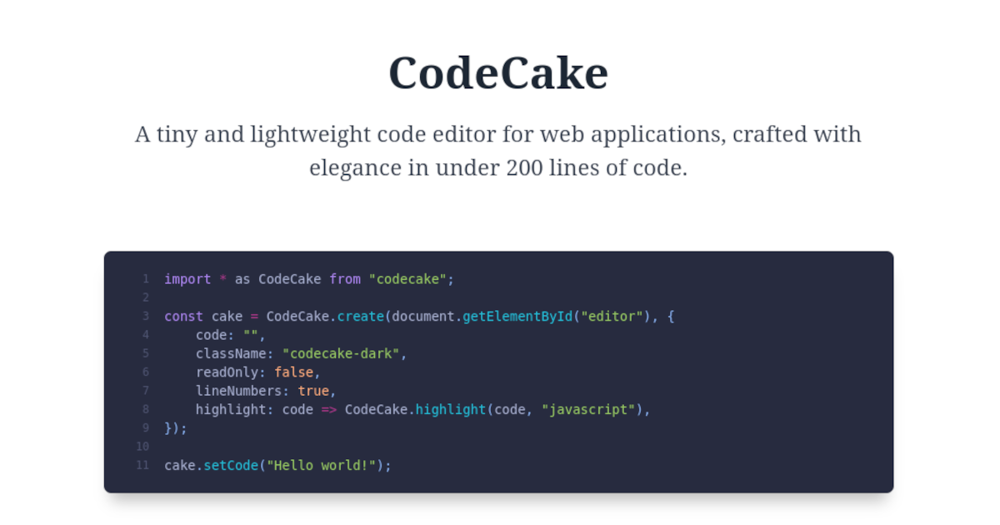

Why another code editor for the web? I wanted something ver simple, tiny and minimalistic, just for editing small chunks of HTML, JavaScript or CSS. Finally I decided to create my own code editor with a small syntax highlight.

## Demo

Visit [josemi.xyz/codecake](https://www.josemi.xyz/codecake) to see a working example of the **CodeCake** editor.

## Getting started

You can install **CodeCake** using npm or yarn:

```bash
## Install using NPM
$ npm install --save codecake

## Or install using yarn
$ yarn add codecake
```

In your HTML code, import the `codecake.css` style:

```html
<link rel="stylesheet" href="https://unpkg.com/codecake/codecake.css">
```

Create a new `<div>` element:

```html
<div id="editor" class=""></div>
```

In your `<script type="module">` tag, import **CodeCake** and initialize the editor:

```html
<script type="module">
    import * as CodeCake from "https://unpkg.com/codecake/codecake.js";

    const parent = document.getElementById("editor");
    const cake = CodeCake.create(parent, {
        language: "javascript",
        className: "codecake-dark",
        highlight: CodeCake.highlight,
    });
</script>
```

## API

### CodeCake.create(target, options)

The first argument of the `CodeCake.create` function is the reference to the `<div>` element. The second argument is an object with the editor options:

- `language`: language of the code. This value will be also passed as the second argument of the function provided in `options.highlight`. Default is `""`.
- `readOnly`: editor will be in read-only mode. Default is `false`.
- `lineNumbers`: editor will display line numbers. Default is `false`.
- `indentWithTabs`: editor will use the tab character `"\t"` for indentation instead of spaces. Default is `false`.
- `tabSize`: number of spaces for a tab. Default is `4`.
- `highlight`: provide a custom function to highlight code. Default is `null` (no highlight). The pprovided function will be called with the current code to highlight and the language string provided in `options.language`.
- `className`: custom classname to customize the editing area. Default is `""`.

The `CodeCake.create` function will return an object with some methods that you can use to manipulate the editor.

Use `cake.getCode()` to get the current code in the editor.

```javascript
const code = cake.getCode();
```

Use `cake.setCode(newCode)` to update the code displayed in the editor.

```javascript
cake.setCode("Hello world");
```

Use `cake.onChange` to register a listener that will be called each time user changes the code.

```javascript
cake.onChange(code => {
    console.log("New code: ", code);
});
```

### CodeCake.highlight(code, language)

We provide a tiny highlight module that you can use to highlight the text in your editor. Only basic web languages are supported (`html`, `javascript`,`css`, and `markdown`). Use this function with the `options.highlight` argument:

```javascript
CodeCake.create(parent, {
    language: "javascript",
    highlight: (code, lang) => {
        return CodeCake.highlight(code, lang);
    },
    // ...other editor options
});
```

## Themes

We provide two themes to customize the editor and the highlighted code: `codecake-light` and `codecake-dark`.

```js
const cake = CodeCake.create(parent, {
    className: "codecake-dark",
    // ...other editor options
});
```

## Custom highlight

You can use other syntax highlight like [highlight.js](https://highlightjs.org/) or [Prism](https://prismjs.com/). Call the syntax highlighter using the `options.highlight` option of `CodeCake.create`:

```js
CodeCake.create(parent, {
    language: "javascript"
    highlight: (code, lang) => {
        return hljs.highlight(code, {language: lang}).value;
    },
    // ...other editor options
});
```

## License

CodeCake is released under the [MIT License](./LICENSE).
